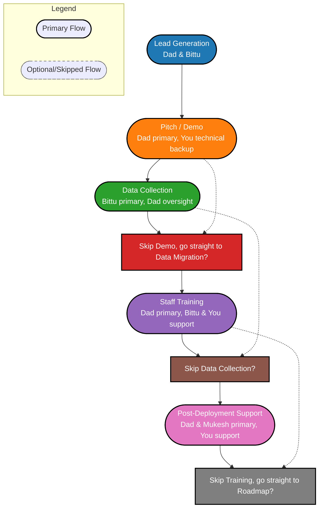

# Masst Campus – Master Workflow

This document captures **business, team, and operational workflow** for Masst Campus, from lead generation to post-deployment support and feature addition.

---

## **1️⃣ Core Team Overview**

| Member        | Designation                   | Responsibilities                                         | Skills                            |
|---------------|------------------------------|----------------------------------------------------------|-----------------------------------|
| You           | CEO & CTO                    | Product strategy, full-stack development, migration oversight, technical backup | Tech architecture, dev, mentoring |
| Dad           | COO / Head of School Adoption | School relationships, pitching, adoption, staff training | Communication, teaching, trust    |
| Mukesh Bhaiya | Migration & Data Lead         | Data migration, validation, running scripts, troubleshooting | Admin, data handling, tech training |
| Bittu Bhaiya  | Operations & Admin Lead       | School liaison, scheduling, data collection, coordination | Admin, trust, operations          |

---

## **2️⃣ Communication & Coordination**

- **Slack:** Channels for `#general`, `#dev`, `#operations`, `#migration`, `#lead-generation`
- **Video Calls:** Google Meet / Zoom for demos, weekly syncs
- **Document Collaboration:** Notion / Google Docs for manuals, roadmap, and training docs
- **Quick Alerts:** WhatsApp / Telegram for urgent updates

**Suggested Meeting Rhythm:**
- Daily standup: 15 min, all 4 members
- Weekly sync: 30–45 min, progress & adoption review
- Bi-weekly sprint review: You + Mukesh, dev & migration progress
- Monthly business review: You + Dad + Bittu, leads, metrics, roadmap

---

## **3️⃣ Business Workflow Steps**

### **Step 1: Lead Generation**
- **Owner:** Dad & Bittu
- **Actions:** Identify target schools, collect basic info, schedule initial contact
- **Tracking:** Slack `#lead-generation` + Trello/Jira board
- **Skills:** Communication, research, relationship building

### **Step 2: Pitch / Demo**
- **Owner:** Dad (primary), You (technical backup)
- **Actions:** Present Masst Campus benefits, dashboard & workflow demo, collect requirements
- **Tracking:** Trello/Jira card per school
- **Skills:** Public speaking, trust building, technical explanation

### **Step 3: Data Collection**
- **Owner:** Bittu (primary), Dad (oversight)
- **Actions:** Collect student, class, attendance, fee data; verify completeness
- **Tracking:** Jira subtasks, Notion / Google Drive storage
- **Skills:** Admin, coordination, attention to detail

### **Step 4: Data Migration**
- **Owner:** Mukesh (primary), You (oversight)
- **Actions:** Clean & standardize data, map fields, run migration scripts, validate integrity
- **Tracking:** Jira `School Migration` board
- **Skills:** Data handling, technical troubleshooting, validation

### **Step 5: Staff Training**
- **Owner:** Dad (primary), You & Bittu (support)
- **Actions:** Teach attendance, fee, notifications workflow; dashboard overview; provide manuals
- **Tracking:** Checklist or Jira board
- **Skills:** Teaching, communication, patience

### **Step 6: Go-Live**
- **Owner:** You & Mukesh, Dad & Bittu support
- **Actions:** Deploy Masst Campus instance, monitor initial usage, resolve immediate issues
- **Tracking:** Jira board, Slack alerts
- **Skills:** Technical troubleshooting, coordination

### **Step 7: Post-Deployment Support**
- **Owner:** Dad & Mukesh (primary), You (support)
- **Actions:** Handle school queries, resolve issues, collect feedback
- **Tracking:** Jira tickets + Slack support channel
- **Skills:** Communication, problem-solving, tech backup

### **Step 8: Feature Addition & Roadmap**
- **Owner:** You (primary), team input from Dad, Bittu, Mukesh
- **Actions:** Add new features to backlog, prioritize, plan sprints, implement & QA
- **Tracking:** Jira backlog, Notion roadmap
- **Skills:** Strategic planning, development, team coordination

---

## **4️⃣ Skills Utilization Matrix**

| Workflow Step           | Dad           | Bittu         | Mukesh         | You                      |
|------------------------ |-------------- |-------------- |--------------- |--------------------------|
| Lead Generation         | ✅            | ✅            |                |                          |
| Pitch / Demo            | ✅ (primary)  |               |                | ✅ (backup)              |
| Data Collection         | ✅ (oversight)| ✅ (primary)  |                |                          |
| Data Migration          |               |               | ✅ (primary)    | ✅ (oversight)           |
| Staff Training          | ✅ (primary)  | ✅ (support)  |                | ✅ (support)             |
| Go-Live                 | ✅            | ✅            | ✅             | ✅                       |
| Post-Deployment Support | ✅            |               | ✅             | ✅                       |
| Feature Addition        |               |               |                | ✅ (primary), team input |

---

## **5️⃣ Workflow Diagram (Visual)** 



---

## **5️⃣ Workflow Diagram (Textual)**

```
Lead Generation (Dad & Bittu)
   |
   v
Pitch / Demo (Dad + You)
   |
   v
Data Collection (Bittu + Dad)
   |
   v
Data Migration (Mukesh + You)
   |
   v
Staff Training (Dad + Bittu + You)
   |
   v
Go-Live (You + Mukesh)
   |
   v
Post-Deployment Support (Dad + Mukesh + You)
   |
   v
Feature Addition & Roadmap (You + Team Input)
```

---

## **6️⃣ Tool Stack for Coordination**

| Purpose                  | Tool              | Notes                       |
|--------------------------|-------------------|-----------------------------|
| Chat / Quick Discussions | Slack             | Channels per function       |
| Video Calls / Demos      | Zoom / Google Meet| Weekly syncs, school pitch  |
| Task Management          | Jira / Trello     | MVP dev, migration, sprints |
| Documentation            | Notion / Google Docs | Training manuals, roadmap, SOPs |
| Alerts / Quick Updates   | WhatsApp / Telegram| Urgent notifications        |

---

## **7️⃣ Notes**

- Dad & Bittu are **first point of contact for schools** to build trust
- You intervene during technical or strategic decisions
- Mukesh handles all **data migration & technical implementation**
- Workflow is **repeatable & scalable**: same steps can be replicated for new schools
- Jira + Slack + Notion combination ensures **smooth tracking, transparency, and coordination**

---

**Outcome:**  
A **single master workflow** covering **all business, operational, and technical steps**, with **clear ownership, coordination, and tools**, ready for execution and long-term scaling.